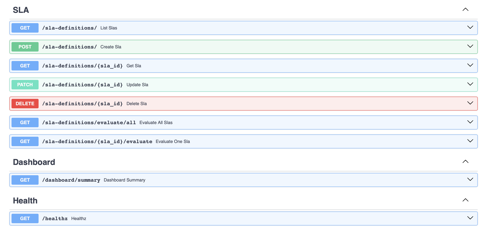
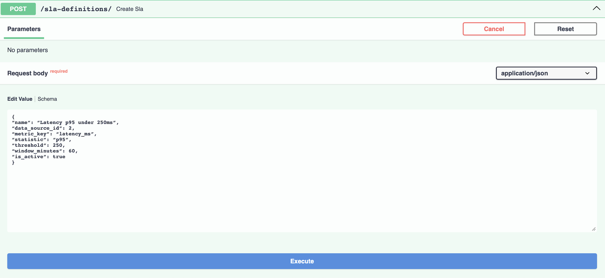
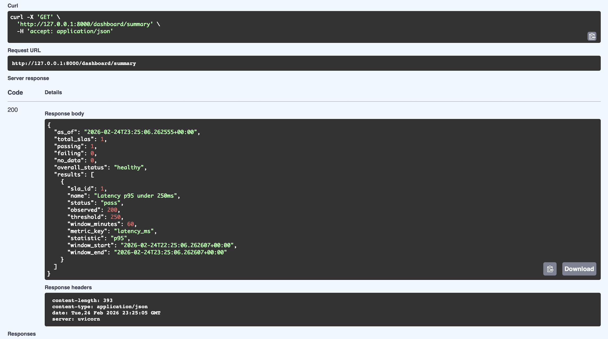
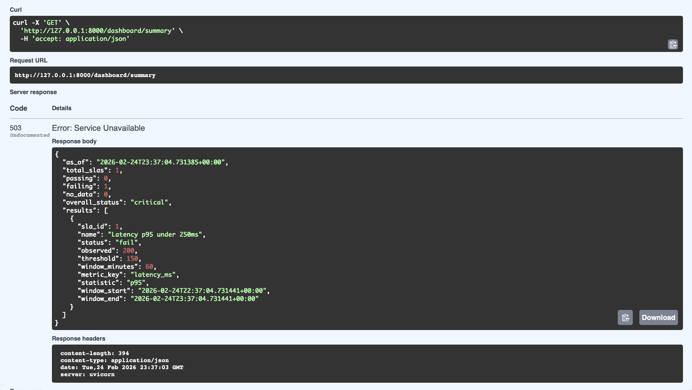

# Decision Support System – SLA Monitoring Service

## Overview

This project implements a simplified enterprise-style SLA monitoring service.

It simulates how real backend systems evaluate Service Level Agreements (SLAs) using time-series metrics and compute overall system health.

The system supports:

- Configurable SLA definitions stored in the database
- Time-windowed metric evaluation
- Multi-SLA aggregation
- Dynamic system health classification
- Proper HTTP health signaling (200, 206, 503)
- Infrastructure-level health checks

This architecture mirrors production observability and reliability systems.

---

## Tech Stack

Backend: FastAPI (Python)  
Database: MySQL  
ORM: SQLAlchemy  
Migrations: Alembic  
ASGI Server: Uvicorn  
Version Control: Git & GitHub  

---

## Architecture Overview

The service is structured into four layers:

### 1. API Layer (FastAPI Routers)
- /sla-definitions
- /dashboard/summary
- /healthz

Handles HTTP request/response flow.

### 2. Service Layer
- SLA evaluation engine
- Rolling window computation
- Pass / fail / no_data classification
- System-wide health escalation logic

File: `backend/app/services/sla_eval.py`

### 3. ORM Layer (SQLAlchemy Models)
- SLADefinition
- MetricPoint
- DataSource

Encapsulates database schema and persistence logic.

### 4. Database Layer
- MySQL
- Stores SLA configurations and time-series metrics
- Drives real-time SLA evaluation

---

## Request Flow

Client → FastAPI Router → SLA Evaluation Service → Database → JSON Response

The `/dashboard/summary` endpoint:

- Evaluates all active SLAs
- Aggregates pass / fail / no_data counts
- Computes overall system status
- Returns appropriate HTTP status codes:

| System State | HTTP Code |
|--------------|----------|
| healthy      | 200      |
| degraded     | 206      |
| critical     | 503      |

This simulates real-world service health signaling used by load balancers and orchestration systems.

---

## System Diagram

```
                +-------------------+
                |   Client / curl   |
                +---------+---------+
                          |
                          v
                +-------------------+
                |   FastAPI Router  |
                |   (/dashboard)    |
                +---------+---------+
                          |
                          v
                +-------------------+
                | SLA Eval Service  |
                +---------+---------+
                          |
                          v
                +-------------------+
                |     MySQL DB      |
                | metric_points     |
                | sla_definitions   |
                +-------------------+
```

---

## Logical Architecture View

Decision Support System
│
├── API Layer
│   ├── SLA Definitions
│   ├── Dashboard Summary
│   └── Health Check (/healthz)
│
├── Service Layer
│   └── SLA Evaluation Engine
│
├── ORM Layer
│   ├── SLADefinition
│   ├── MetricPoint
│   └── DataSource
│
└── Database
    └── MySQL (time-series metric storage)

---

## Example API Usage

### Create an SLA

```
curl -X POST http://127.0.0.1:8000/sla-definitions/ \
  -H "Content-Type: application/json" \
  -d '{
    "name": "Latency p95 under 250ms",
    "data_source_id": 2,
    "metric_key": "latency_ms",
    "statistic": "p95",
    "threshold": 250,
    "window_minutes": 60,
    "is_active": true
}'
```

### Insert a Metric

```
./.venv/bin/python -c "
from datetime import datetime
from app.db import SessionLocal
from app.models.metric_point import MetricPoint
db=SessionLocal()
now=datetime.utcnow()
mp=MetricPoint(product_id=2, metric_name='latency_ms',
               ts_bucket=now, value=200.0, computed_at=now)
db.add(mp)
db.commit()
db.close()
"
```

### Check Dashboard Health

```
curl -i http://127.0.0.1:8000/dashboard/summary
```

### Infrastructure Health Check

```
curl -i http://127.0.0.1:8000/healthz
```

Healthy system example:

```
HTTP/1.1 200 OK
{
  "overall_status": "healthy"
}
```

Critical system example:

```
HTTP/1.1 503 Service Unavailable
{
  "overall_status": "critical"
}
```

---

## Multi-SLA Flexibility

The system supports multiple SLA types without code modification.

Examples:
- latency_ms
- error_rate
- cpu_usage
- throughput

Each SLA defines:
- metric_key
- threshold
- statistic
- rolling window

This enables flexible monitoring across heterogeneous metrics.

---

## Future Improvements

- Add data_source_id directly to metric_points (remove temporary product_id mapping)
- Support additional aggregation strategies and custom SLA expressions
- Add authentication (API key or JWT)
- Implement background ingestion jobs
- Integrate alerting (Slack, email, webhook)
- Add caching for dashboard summary
- Build visualization layer for SLA trend analysis

---

## API Screenshots

### Swagger Overview


### Create SLA Request


### Dashboard Healthy (HTTP 200)


### Dashboard Critical (HTTP 503)


---

## Why This Project Matters

This is not a simple CRUD application.

It demonstrates:

- Time-series metric evaluation
- Business-rule-driven health escalation
- Service-layer separation
- Proper HTTP health semantics
- Database-backed configuration
- Observability system design principles

This reflects architectural patterns used in real backend reliability and monitoring systems.